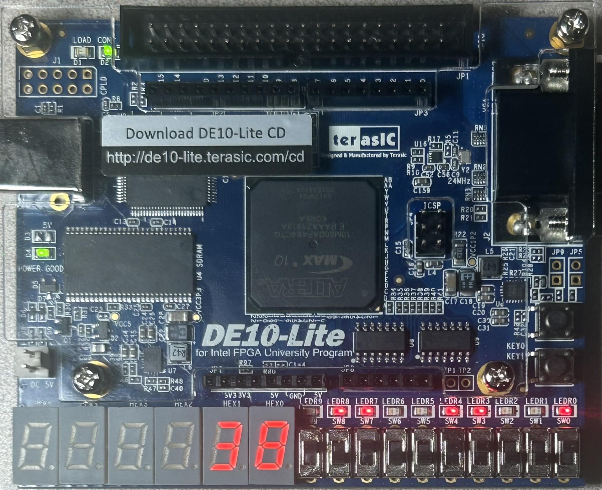
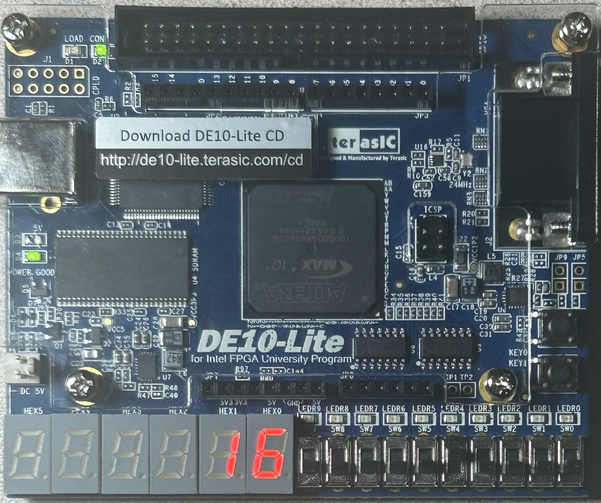

## Part I

   
  <em>Figure 1: Part 1 Verilog Code - Main Module.</em>

   
  <em>Figure 2: Part 1 Verilog Code - 7 Segment Decoder Module.</em>

## Part II

## Part III

   
  <em>Figure 3: Part III Verilog Code - Main Module.</em>

   
  <em>Figure 4: Part 1 Verilog Code - Full Adder Module.</em>

   
  <em>Figure 5: Part III Verilog Code - Adder Module.</em>

   
  <em>Figure 6: Part 1 Verilog Code - Adder Module cont..</em>

## Part IV

   
  <em>Figure 7: Part IV Verilog Code - Main Module.</em>

   
  <em>Figure 8: Part 1V Verilog Code - Main Module Cont..</em>

   
  <em>Figure 9: Part IV Verilog Code - BCD Module.</em>

   
  <em>Figure 10: Part 1V Verilog Code - BCD Module cont..</em>

   
  <em>Figure 11: Part 1V Verilog Code - BCD Module cont..</em>

   
  <em>Figure 12: FPGA displaying output for test case A.</em>

   
  <em>Figure 13: FPGA displaying output for test case B.</em>

   
  <em>Figure 14: FPGA displaying output for test case C.</em>

## Part V

   
  <em>Figure 15: .</em>

   
  <em>Figure 16: .</em>

   
  <em>Figure 17:.</em>

   
  <em>Figure 18 .</em>

   
  <em>Figure 19: FPGA displaying output for test case A.</em>

   
  <em>Figure 20: FPGA displaying output for test case B.</em>

   
  <em>Figure 21: FPGA displaying output for test case C.</em>

   
  <em>Figure 22: FPGA displaying output for test case C.</em>

## Part VI Remember to get RTL

   
  <em>Figure 15: .</em>

   
  <em>Figure 16: .</em>

   
  <em>Figure 17:.</em>

## Part VII

   
  <em>Figure 20: FPGA displaying output for test case A.</em>

   
  <em>Figure 21: FPGA displaying output for test case B.</em>

   
  <em>Figure 22: FPGA displaying output for test case C.</em>

