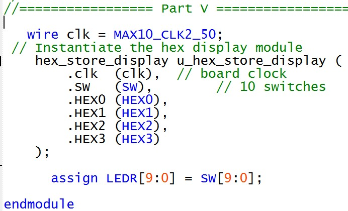

# Lab 3: Latches, Flip Flops, and Registers
*Duncan Wood*  
*09/22/2025*

---

## Part I - Gated SR Latch
A gated sr latch was implemented in verilog code as shown in figures 1 and 2 below. Figure 1 shows the module code for the sr latch and figure 2 shows the sr latch instantiated inside the top-level main code.

   
  <em>Figure 1: RS Latch Module.</em>

 

   
  <em>Figure 2: Part I Main.</em>

### RTL Layout
Figure 3 shows the RTL layout of the sr latch.

   
  <em>Figure 3: RS Latch RTL Layout.</em>

## Part II - Gated D Latch
Figure 4 shows the verilog module code for the gated D latch.

   
  <em>Figure 4: D Latch Module.</em>

 
Figure 5 shows the D latch module instantiated into the top-level main code.

   
  <em>Figure 5: Part II Main.</em>

### RTL Layout
Figure 6 shows the RTL layout for the D latch

   
  <em>Figure 6: D Latch RTL Layout.</em>

## Part III - Positive Edge Triggered D Flip Flop
Figure 7 below shows the verilog module code for the d flip flop.

   
  <em>Figure 7: D Flip Flop Module.</em>

 
Figure 8 shows the d flip flop integrated into the top-level main code.

   
  <em>Figure 8: Part III Main.</em>

### RTL Layout
The figure below shows the RTL layout for the gated d flip flop.

   
  <em>Figure 9: D Flip Flop RTL Layount</em>

## Part IV
Figure 10 shows the verilog code for part IV, connecting a D latch, positive edge D flip flop, and a negative edge flip flop. To create the negative edge flip flop from the original positive edge, the cases for negating the clock were flipped.

   
  <em>Figure 10: Part IV Verilog Code Main.</em>

### RTL Layout
Figure 11 below shows the RTL design for Part IV.

   
  <em>Figure 11: RTL Layout.</em>

## Part V
Figures 12 to 15 show the verilog code module for Part V to create a 16 bit hexidecimal display capable of storing the most recent number.

   
  <em>Figure 12: Module .</em>

   
  <em>Figure 13: Module .</em>
  

   
  <em>Figure 14: Module .</em>

  

   
  <em>Figure 15: Module .</em>

  
  Figure 16 below shows the verilog module instantiated into the top-level main code.
  

   
  <em>Figure 16: Main .</em>

  ### RTL Layout
  Figure 17 shows the outer view of the RTL layout.
  

   
  <em>Figure 17: RTL Layout .</em>

Figure 18 shows the internal RTL layout.
  

   
  <em>Figure 18: RTL Layout .</em>

### Demos
[▶️ Watch the demo](img/IMG_1382.mp4)
