# Lab 3: Latches, Flip Flops, and Registers
*Duncan Wood*  
*09/22/2025*

---

## Part I - Gated SR Latch
A gated sr latch was implemented in verilog code as shown in figures 1 and 2 below.

  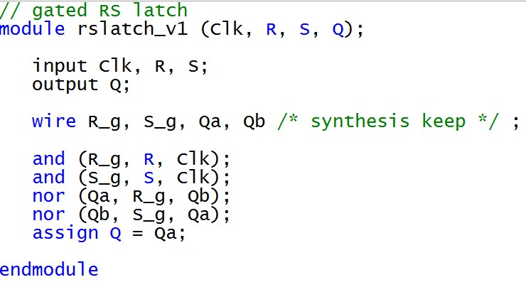 
  <em>Figure 1: RS Latch Module.</em>

 

  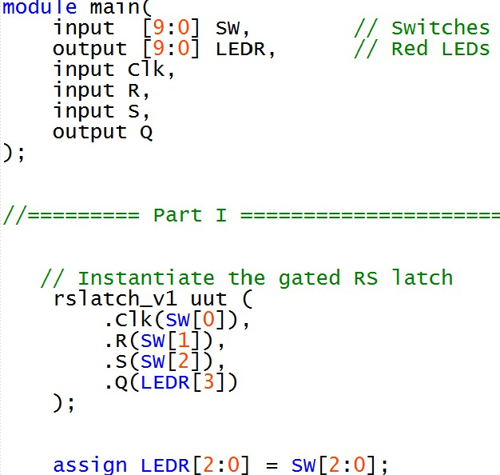 
  <em>Figure 2: Part I Main.</em>

### RTL Layout

  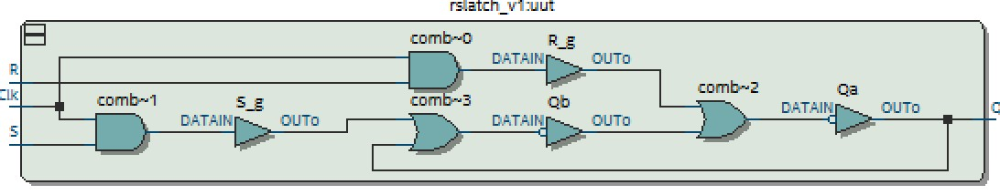 
  <em>Figure 3: RS Latch RTL Layout.</em>

## Part II - Gated D Latch

  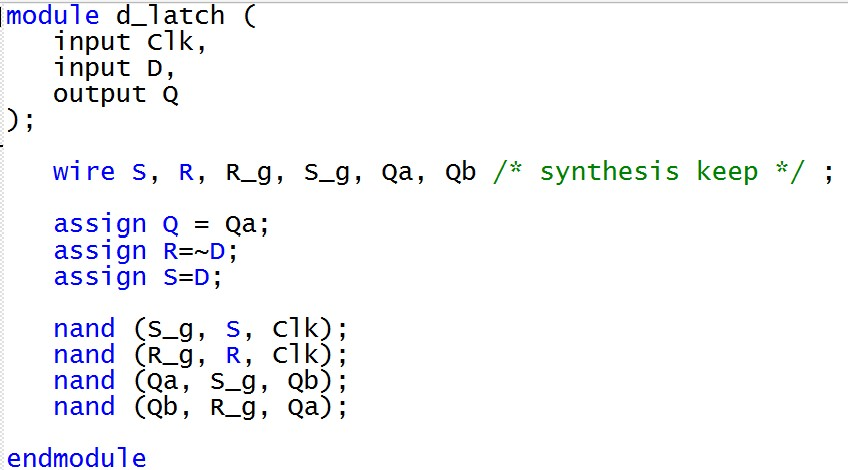 
  <em>Figure 4: D Latch Module.</em>

 

  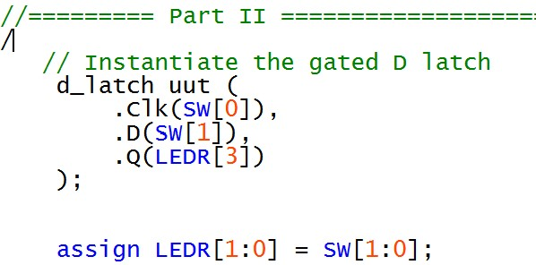 
  <em>Figure 5: Part II Main.</em>

### RTL Layout

  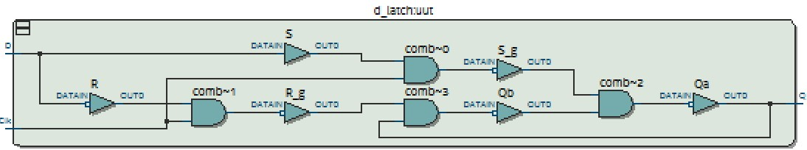 
  <em>Figure 6: D Latch RTL Layout.</em>

## Part III - Positive Edge Triggered D Flip Flop

  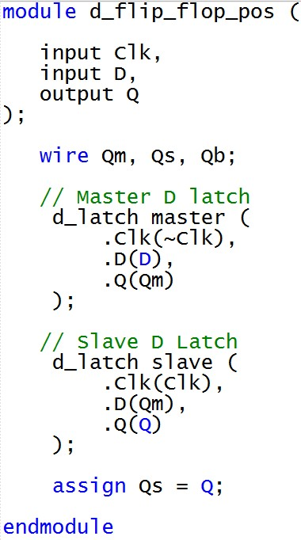 
  <em>Figure 7: D Flip Flop Module.</em>

 

  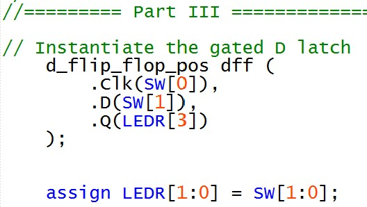 
  <em>Figure 8: Part III Main.</em>

### RTL Layout

  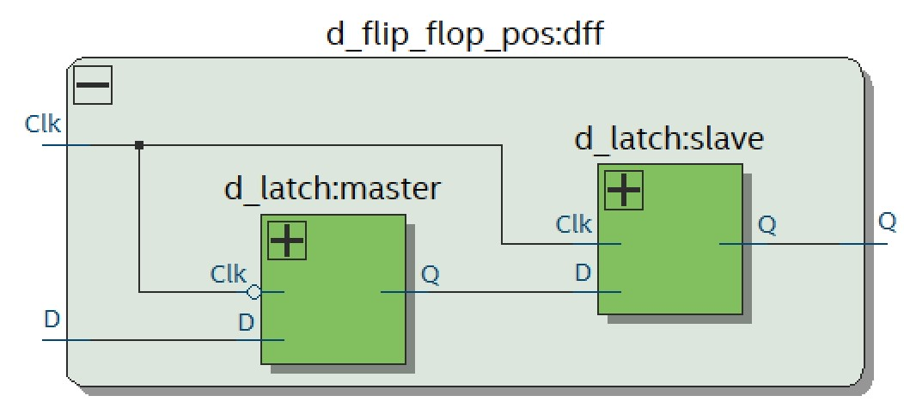 
  <em>Figure 9: D Flip Flop RTL Layount</em>

## Part IV

  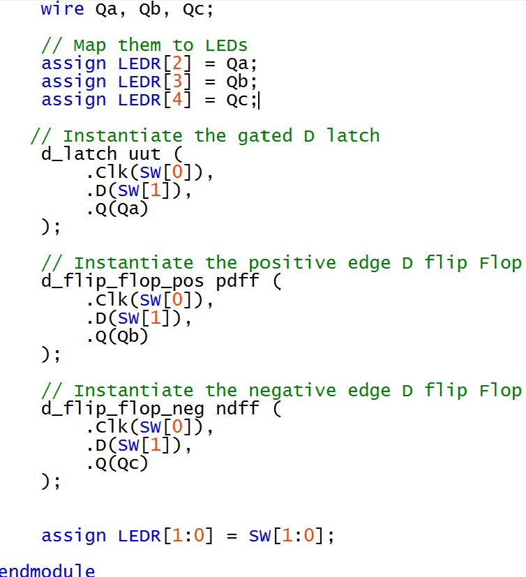 
  <em>Figure 10: Part IV Verilog Code Main.</em>

### RTL Layout

  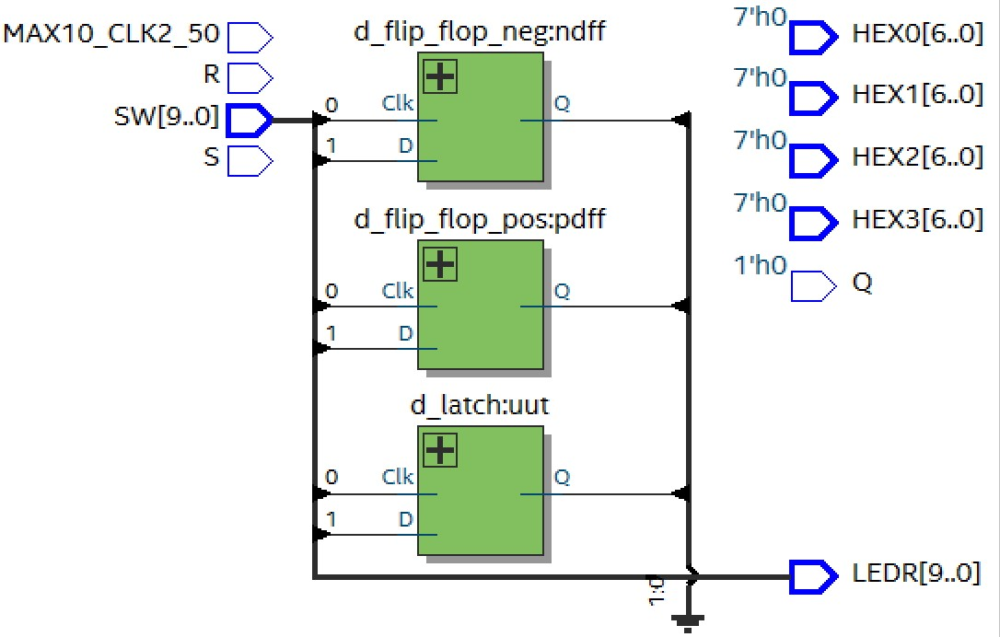 
  <em>Figure 11: RTL Layout.</em>

## Part V

  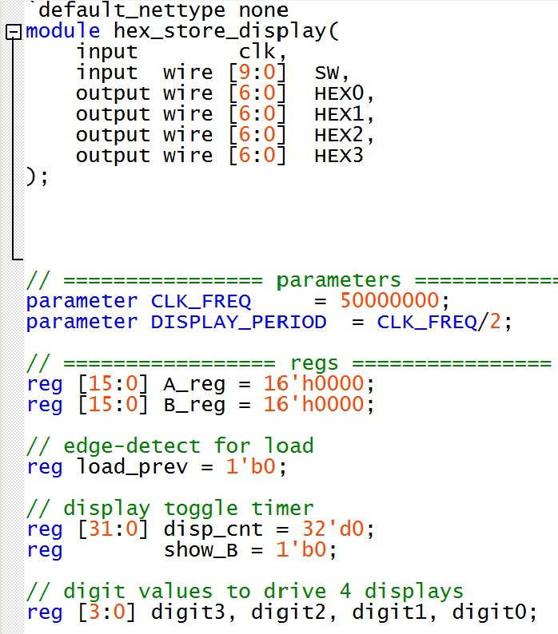 
  <em>Figure 12: Module .</em>

  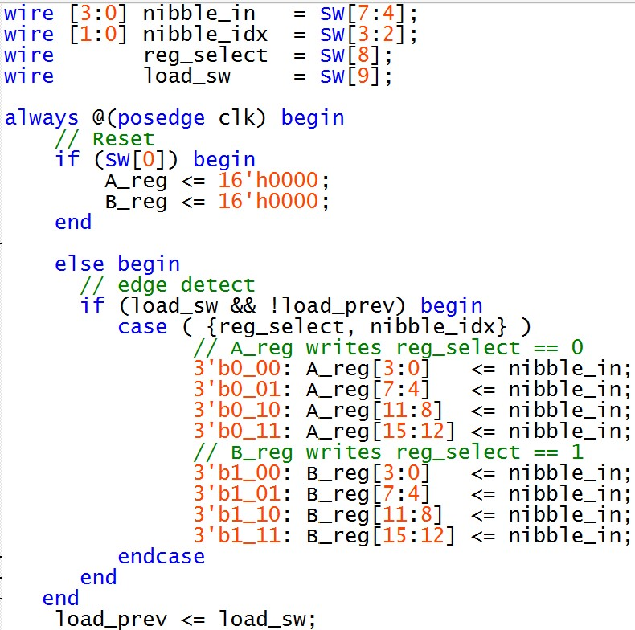 
  <em>Figure 13: Module .</em>
  

  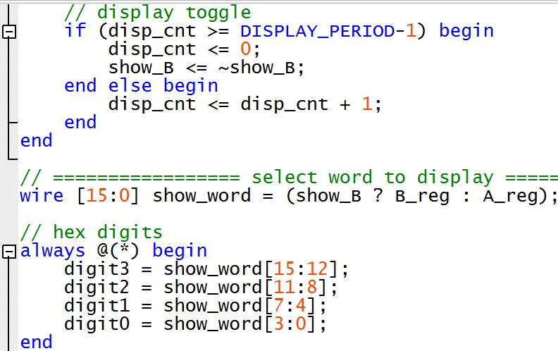 
  <em>Figure 14: Module .</em>

  

  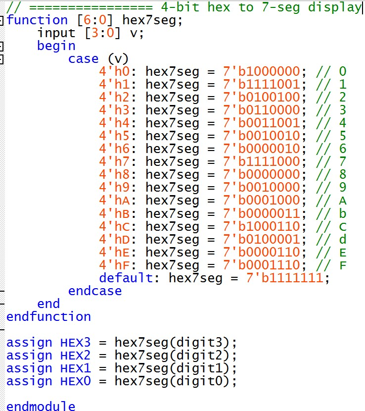 
  <em>Figure 15: Module .</em>

  ### RTL Layout
  

  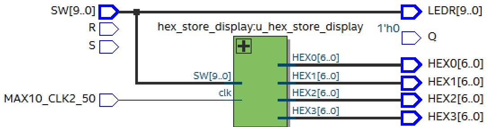 
  <em>Figure 16: RTL Layout .</em>

  

  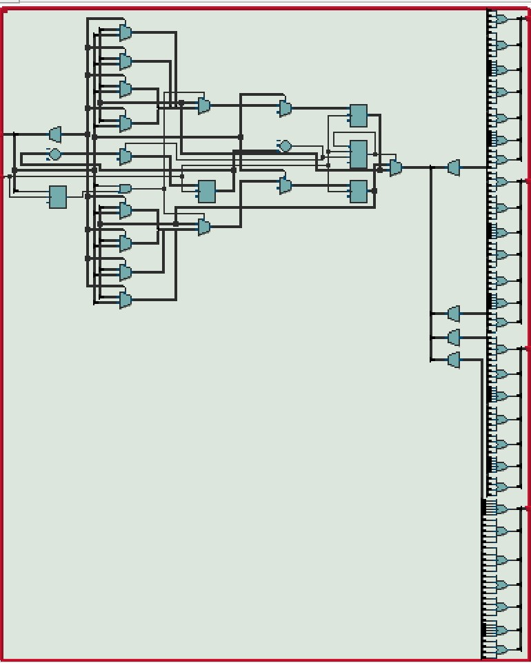 
  <em>Figure 16: RTL Layout .</em>

