# Lab 4: Counters
*Duncan Wood*  
*09/29/2025*

---
## Part I
First a 1 bit T flip flop was created

  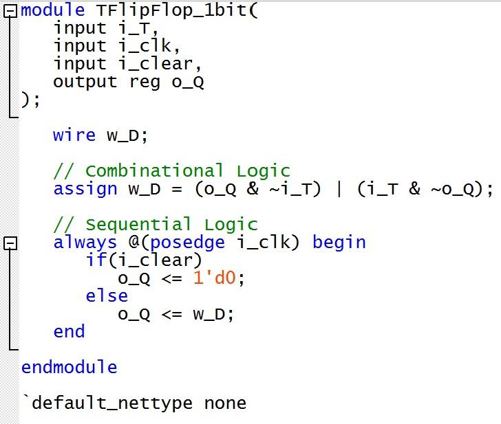 
  <em>Figure 1: 1 Bit T Flip Flop.</em>

 
Next, an 8-bit flip flop was created

  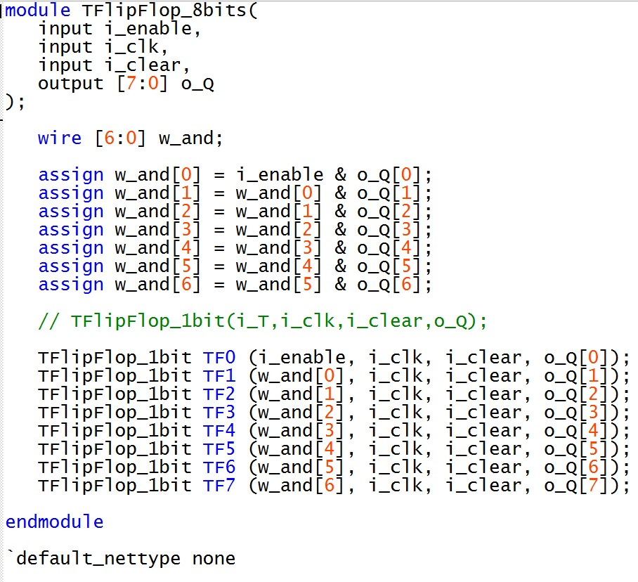 
  <em>Figure 2: 8 Bit T Flip Flop.</em>

 
Then the 8 bit flip flop module was instantiated into the top-level code and connected to 2 7-segment displays

  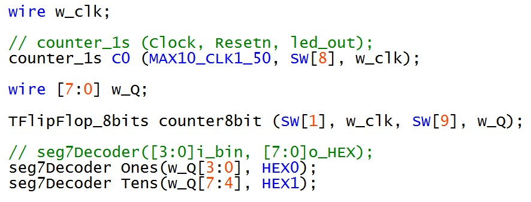 
  <em>Figure 3: T Flip Flop Counter Top-Level Code.</em>

 

### RTL View

  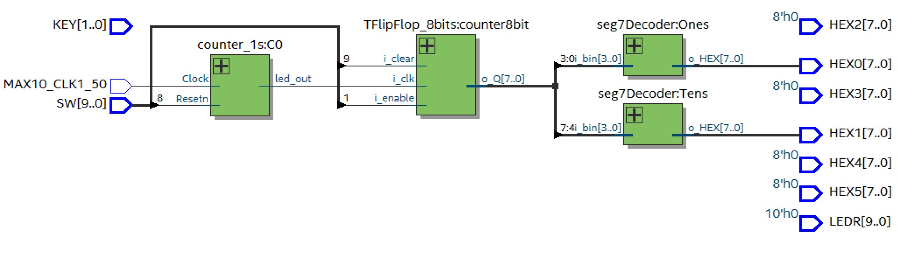 
  <em>Figure 4: Top-Level RTL View.</em>

 

  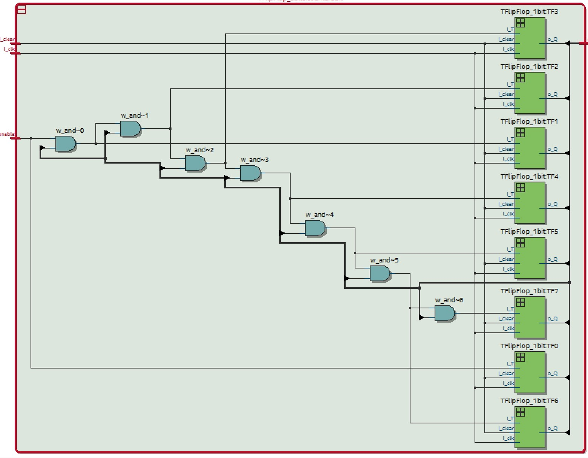 
  <em>Figure 5: T Flip Flop Counter RTL View.</em>

 

## Part II
A 16 bit counter was created

  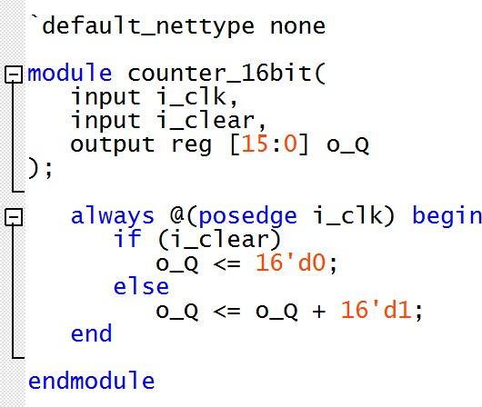 
  <em>Figure 6: 16 Bit Counter Module.</em>

 
Next a shift register was created using the 16 bit counter module on the main code with 2 7-segment displays connected.

  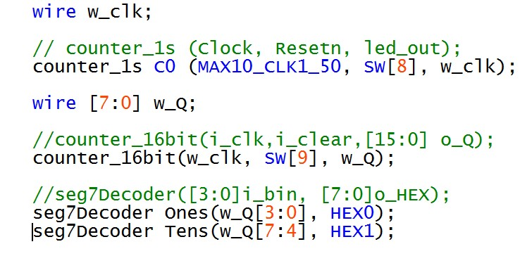 
  <em>Figure 7: Part II Top-level Code.</em>

 

## Part III
A ciruit with the same functionality as Part II was created using an LPM from the Library of Parameterized modules to implement a 16-bit counter.

  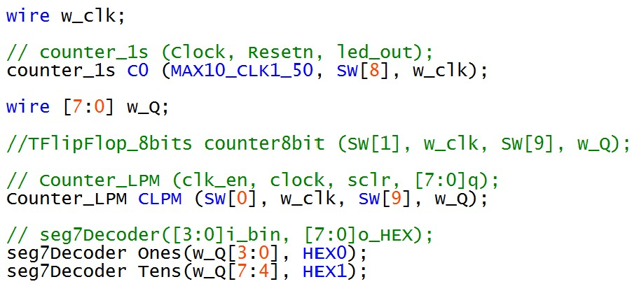 
  <em>Figure 8: Part III Top-level Code.</em>

No noticeable differences were seen in the performance of this code compared to that of Part II.

## Part IV
a verilog code was created that blinks digits 0-9 on HEX0 7-segment display in 1 second intervals, resetting and continuing in loops.

  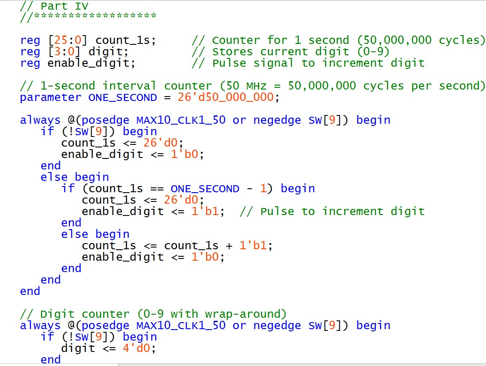 
  <em>Figure 9: e.</em>

  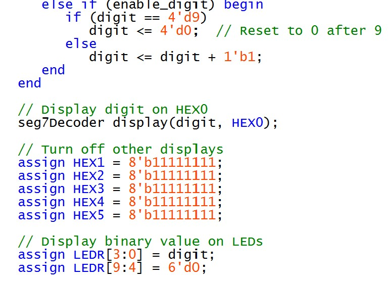 
  <em>Figure 10: e.</em>

   
  <em>Figure 11:.</em>

  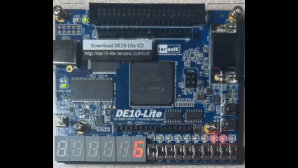 
  <em>Figure 12:.</em>

## Part V

  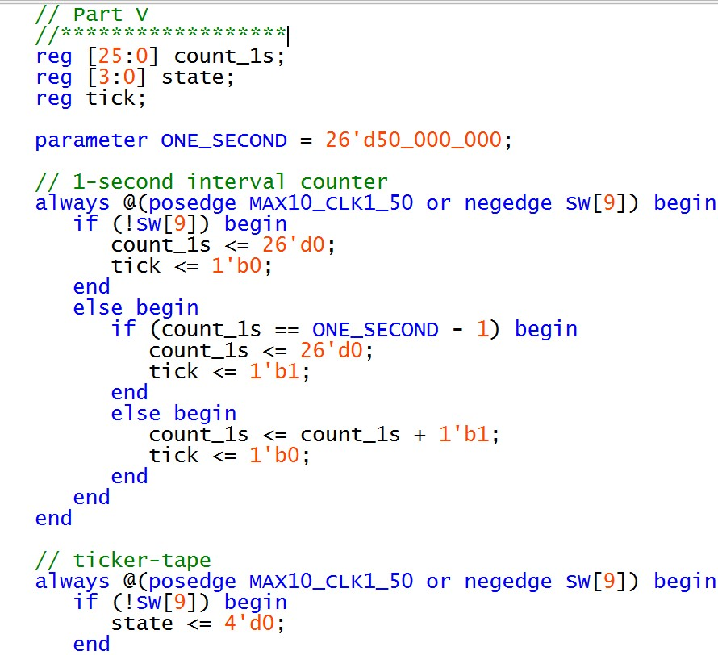 
  <em>Figure 13: .</em>

  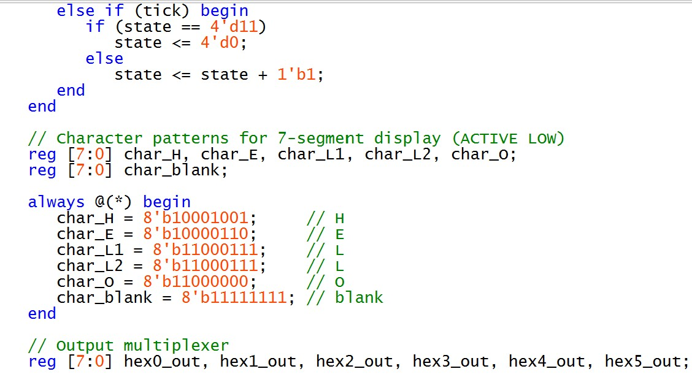 
  <em>Figure 14: .</em>

  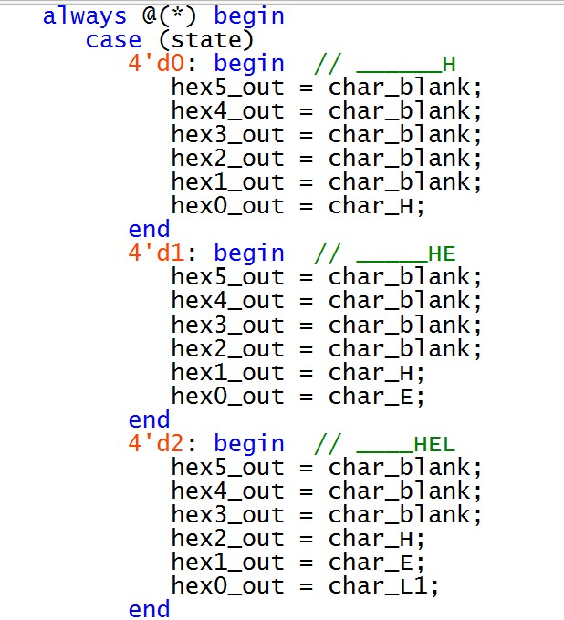 
  <em>Figure 15: .</em>

  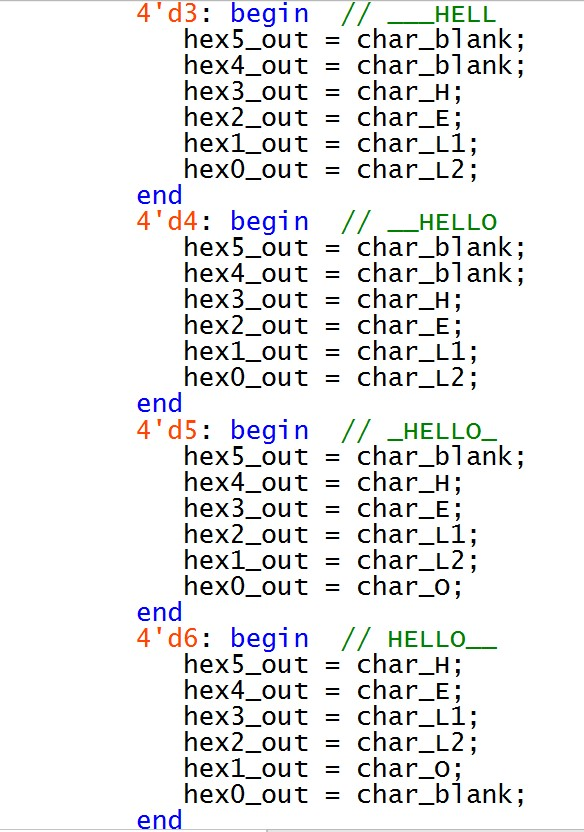 
  <em>Figure 16: .</em>

  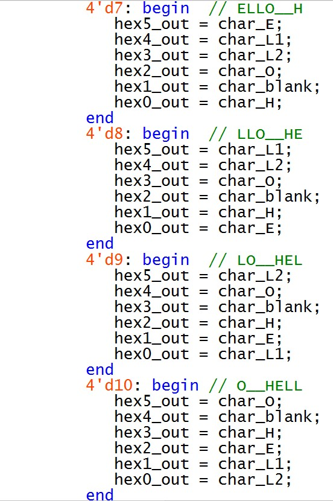 
  <em>Figure 17: .</em>

  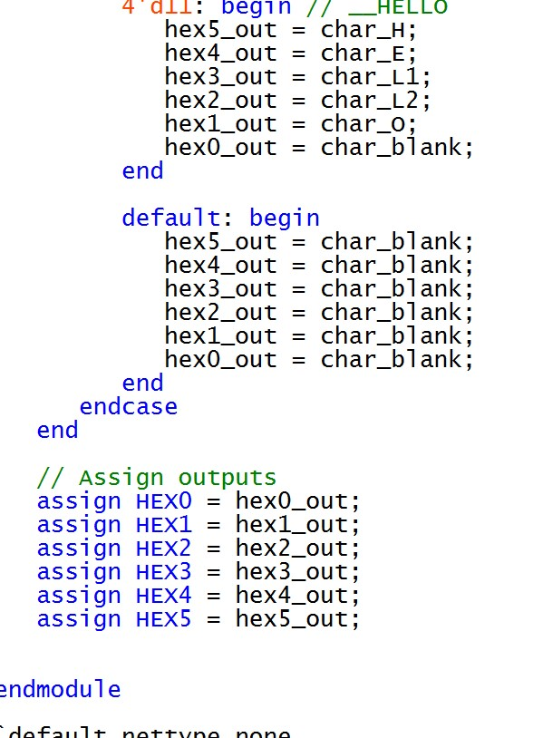 
  <em>Figure 18: .</em>

   
  <em>Figure 19:.</em>

