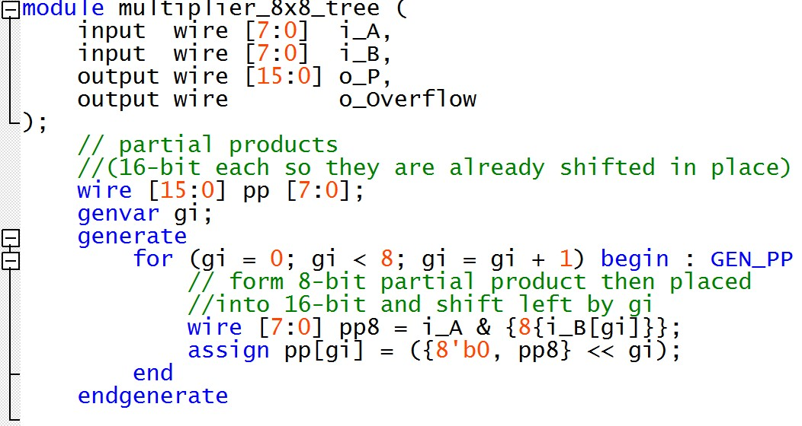

# Lab 4: Subtractors and Multipliers
*Duncan Wood*  
*10/7/2025*

---
## Part I

   
  <em>Figure 1: Part I Top-Level Verilog </em>

 

   
  <em>Figure 2: 8-Bit Accumulator </em>

 

## Part II

   
  <em>Figure 3: Part II Top-Level Verilog</em>

 

   
  <em>Figure 4: 8-Bit Accumulator - Add and Subtract </em>

 

## Part III

   
  <em>Figure 6: Part III Top-Level Verilog </em>

 

   
  <em>Figure 6: 4 x 4 Multiplier </em>

 

   
  <em>Figure 7: 4 x 4 Multiplier continued </em>

 

   
  <em>Figure 8: 4 x 4 Multiplier continued </em>

 

## Part IV

   
  <em>Figure 9: Part IV Top-Level Verilog </em>

 

   
  <em>Figure 10: Part IV Top-Level Verilog continued </em>

 

   
  <em>Figure 11: 8 x 8 Multiplier </em>

 

   
  <em>Figure 12: 8 x 8 Multiplier continued </em>

## Part V
A new 8x8 multiplier was created with the same functionality as Part IV but using the Adder Tree method instead of the Ripple-Carry method.

   
  <em>Figure 13: Adder Tree </em>

The generate block creates a "loop" that instantiates multiple copies of identical logic, resulting in 8 partial product wires.
 
The block builds the partial product array without having to write out eight repetitive lines.

   
  <em>Figure 14: Adder Tree Continued </em>

The parallel summations are created by structuring the given tree using defined wires.
