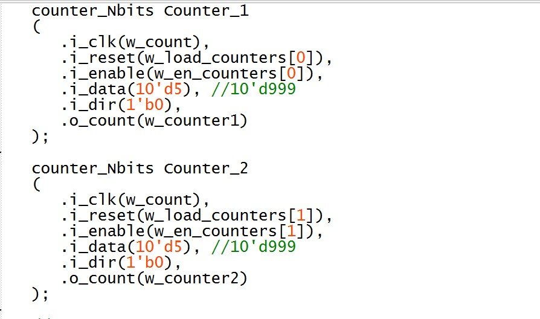

# Lab 6: Chess Timer FSM
*Duncan Wood*  
*10/14/2025*

## Table of Contents
- [Objective](#Objective)
- [FSM Derivation](#FSMDerivation)
- [Chess Timer FSM Module](#ChessTimerFSMModule)
- [Top-Level Module](#Top-LevelModule)
- [1 Second Counter](#1SecondCounter)
- [N Bit Counter](#NBitCounter)
- [Demonstation](#Demonstration)

## Objective
The goal of this FSM verilog code is to act as a chess timer. The chess timer works by having two independent clock timers of equal time and speed, one for each of the two chess players. The timer starts out in a neutral or 'idle' state in which neither timer is active and doesn't start until one of the players presses the button to initiate their own timer. When one player's timer is active, the other one is paused. When one of the timers goes to zero, the game is over.
 
 
The first step in designing this chess timer, is writing the finite state machine (FSM) to represent the desired process of the system.

## FSM Derivation
Four possible states:
 
idle - Waiting for game to begin
 
Player A - Player A's timer is active, Player B's timer is paused.
 
Player B - Player B's timer is active, Player A's timer is paused.
 
Game Over - One of the timers reached zero.
 
 

   
  <em>Figure 1: FSM Diagram </em>

The next step is designing the verilog module for the chess module FSM.
 
 

## Chess Timer FSM Module
As per usual the module starts out by declaring inputs, outputs, and local parameters for the function. This includes the clock and reset for the memory elements, inputs and output counters, and the FSM states as parameters.
 
 
Next the state register is written to decide whether to start over with reset or move on to the next state based on the logic.

   
  <em>Figure 2: FSM Verilog </em>

 
The next-state logic is written based on the FSM designed earlier, switching between the 4 states in reaction to the 1-bit input w (buttons) and order of such.
 
 

   
  <em>Figure 3: FSM Verilog </em>

 
Next the output logic is declared using a case statement. The case statement runs each of the counters based on the present state of the system.
 
 

   
  <em>Figure 4: FSM Verilog </em>

## Top-Level Code
The inputs and outputs are assigned to FPGA elements (i.e. switches, LEDs, buttons, and 7-segment displays). Wires are also set up to connect said elements.
 
 

   
  <em>Figure 5: Top-Level Verilog </em>

 
The chess timer fsm module and the 1 second counter are instantiated inside the top-level code.
 
 

   
  <em>Figure 6: Top-Level Verilog </em>

 
Next the two n-bit counters are instanstiated inside the top-level code for the two timers.
 
 

   
  <em>Figure 7: Top-Level Verilog </em>

 
And last, the display control for the 7-segment displays is instantiated to display the timers.
 
 

   
  <em>Figure 8: Top-Level Verilog </em>

## 1 Second Counter
Divides the 50 MHz system clock down to a 1 Hz strobe (o_strobe), effectively producing a “1 second tick.” This signal is used as the timing source for the player counters.
 
 

   
  <em>Figure 9: 1 Second Counter </em>

   
  <em>Figure 10: 1 Second Counter </em>

- A 26-bits is used so the counter can go up to 50 million.
- It counts up every 50 MHz clock cycle.
- When it reaches 50M
  - Resets the counter to 0.
  - Toggles o_tick
  - Sets o_strobe=1 for one clock cycle.
The o_strobe pulse is the 1 Hz clock signal which is used for w_count in the top module.

## N Bit Counter
The N-bit counter module is used for the timer for each player, player A and player B. They decrement every second while their respective player is active and stores the current value for when it is paused.
 
 

   
  <em>Figure 11: N-Bit Counter </em>

 
 

- i_clk: Driven by w_count, which ticks once per second.
- i_rest: When w_load_counters[x] = 1, reloads to i_data
- i_enable: Controlled by FSM; only the active player's counter decrements.
- i_dir: Direction bit (0=down, 1=up)
  - In the chess timer, both are configured as down counters (i_dir = 0)
Each second, the active player’s counter decrements by 1 until reaching 0.

## Demonstration

