# Lab 7: Word Detector with UART
*Duncan Wood*  
*10/20/2025*

## Table of Contents
- [Objective](#Objective)
- [Top-Level Module](#Top-LevelModule)
- [Asynchronous Transmitter](#AsychronousTransmitter)
- [Asynchronous Receiver](#AsychronousReceiver)
- [Baud Rate Generator](#BaudRateGenerator)
- [7-Segment Decoder](#7-SegmentDecoder)
- [Word Detector FSM](#WordDetectorFSM)
- [3-Second Counter](#3-SecondCounter)
- [Demonstration](#Demonstration)

## Objective
The objective of this lab was to develop a Verilog design that enables character transmission from a PC to an FPGA board via UART communication. The FPGA receives and interprets the incoming characters, and when the sequence "HELLO" is detected, it displays the word on the on-board 7-segment displays. In essence, characters entered through a serial terminal on the PC are sent over a UART connection to the FPGA, which continuously monitors the input stream and triggers the 7-segment display output when the word "HELLO" is typed.
 
 

## Top-Level Module

  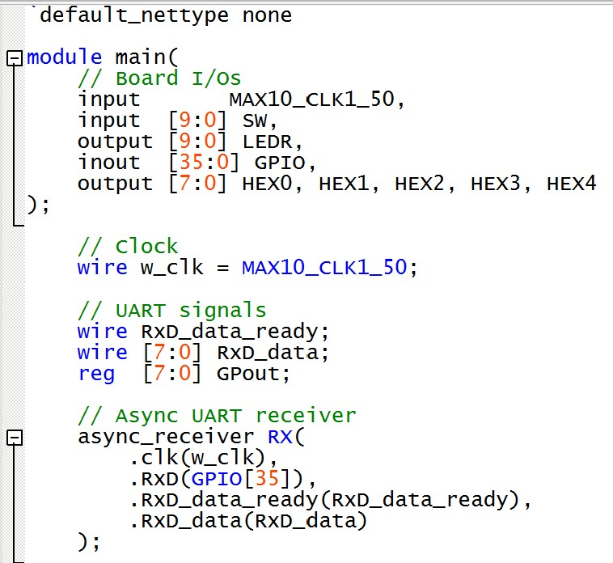 
  <em>Figure 1: Top-Level Module </em>

  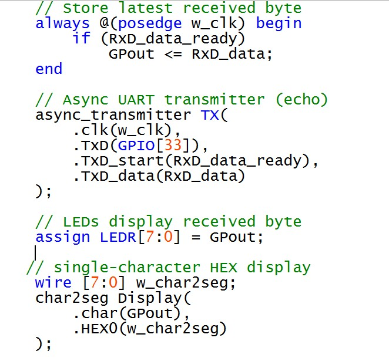 
  <em>Figure 2: Top-Level Module </em>

  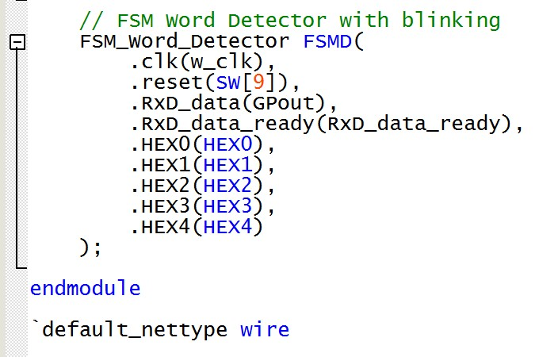 
  <em>Figure 3: Top-Level Module </em>

 
 

Operations:
- Clocking:
  - Uases a 50 MHz as the main system clock.
- UART Reception:
  - Reads serial data from GPIO[35] pin.
  - Signals when new byte is ready (RxD_data_ready)
- Data Handling:
  - Stores latest received byte in register GPout
- UART Transmission:
  - GPIO[33] (TxD) receives byte sent by RxD.
  - Starts transmission when RxD_data_ready goes high.
- LED Display:
  - LEDR[7:0] shows binary value of the received byte.
- Character Display:
  - Converts ASCII character to 7-segment display encoding.
- Word Detection:
  - Monitors received bytes for the word “HELLO”
  - Displays blinking “HELLO” across five 7-segment displays when detected.

## Asynchronous Transmitter
Implements a UART transmitter to send serial data at a specified baud rate.
 
 

Operations:
- Parameters: ClKFrequency = 50 MHz, Baud = 115200.
- Generates a BitTick timing signal using BaudTickGen module.
- Manages bit-level transmission via TxD_state FSM:
  - Sends start bit, 8 data bits, 2 stop bits.
- TxD_busy indicates active transmission.
- Outputs serial bitstream on TxD.

  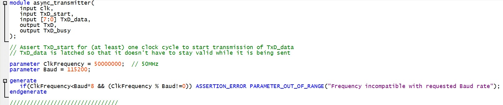 
  <em>Figure 4: Asynchronous Transmitter Module </em>

   
  <em>Figure 5: Asynchronous Transmitter Module </em>

   
  <em>Figure 6: Asynchronous Transmitter Module </em>

  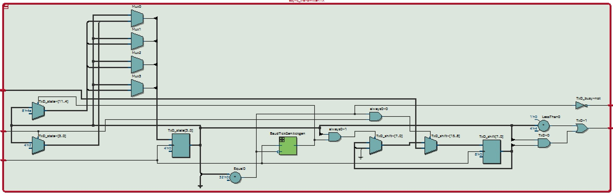 
  <em>Figure 7: Asynchronous Transmitter RTL </em>

## Asynchronous Receiver
Implements a UART receiver to sample incoming serial data, reconstruct bytes, and detect packet boundaries.
 
 

Operations:
- Parameters: ClkFrequency = 50 MHz, Baud = 115200, Oversampling = 8.
- Oversamples input line to accurately sample data bits.
- Synchronizes and filters the input (RxD) to reduce noise.
- FSM detects start bit, samples 8 data bits, and confirms stop bit.
- Outputs:
  - RxD_data: received byte.
  - RxD_data_ready: high for one clock cycle to indicate RxD_data was received.
  - RxD_idle and RxD_endofpacket: packet detection indicators

 
 

   
  <em>Figure 8: Asynchronous Receiver Module </em>

  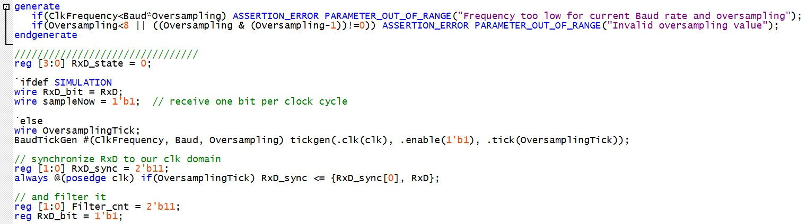 
  <em>Figure 9: Asynchronous Receiver Module </em>

  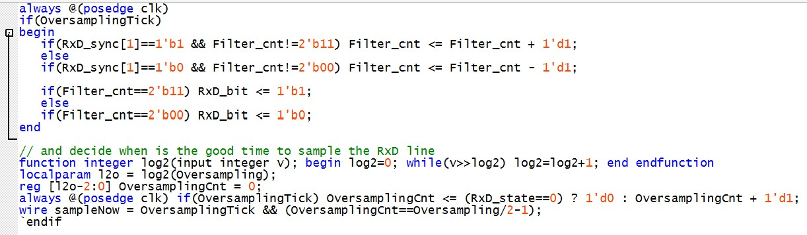 
  <em>Figure 10: Asynchronous Receiver Module </em>

  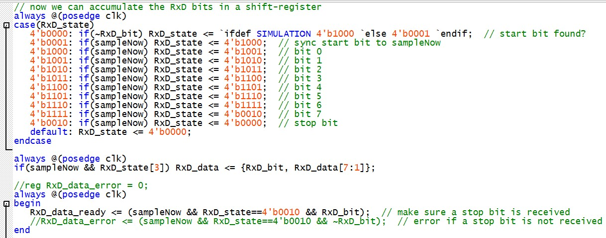 
  <em>Figure 11: Asynchronous Receiver Module </em>

   
  <em>Figure 12: Asynchronous Receiver Module </em>

  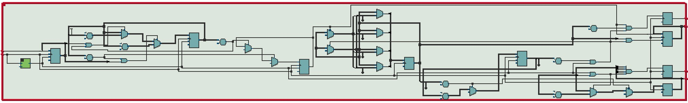 
  <em>Figure 13: Asynchronous Receiver RTL </em>

## Baud Rate Generator

Generates precise baud-rate timing ticks for UART transmission/reception.
 
 

  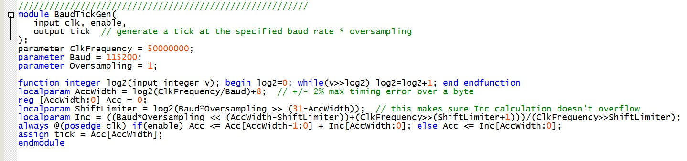 
  <em>Figure 14: Baud Rate Generator </em>

 
 

Operations:
- Uses an accumulator-based algorithm to divide system clock to baud rate.
- Produces a tick signal at baud rate × oversampling frequency (baud x 8).

## 7-Segment Decoder
Converts an 8-bit ASCII character into 7-segment LED encoding for display.

  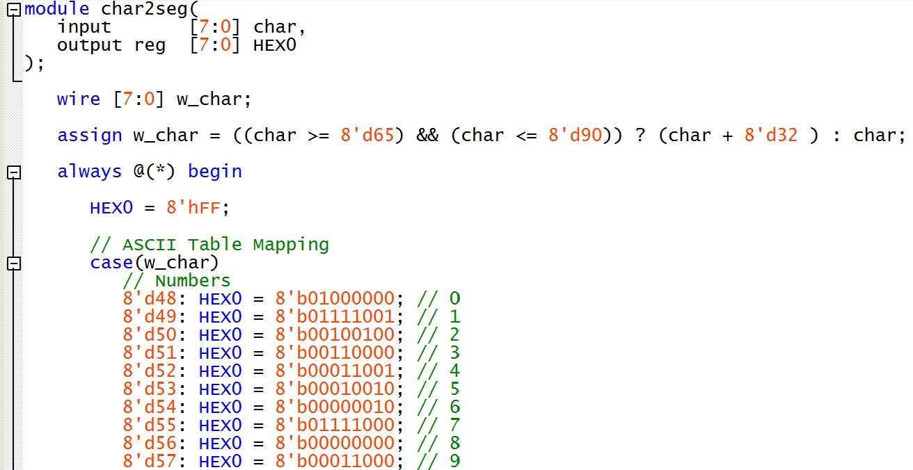 
  <em>Figure 14: 7-Segment Decoder </em>

   
  <em>Figure 15: 7-Segment Decoder </em>

 
 

Operations:
- Maps digits (0–9) and letters (a–z) to corresponding 7-segment patterns.
- Converts uppercase letters (A–Z) to lowercase (a–z) for uniform decoding.
- Converts select characters that aren't displayable on the HEX display (k,m,t,etc.) to a 'dot' shape.
- Outputs 8-bit encoding (HEX0) for use by display drivers.

 
 

  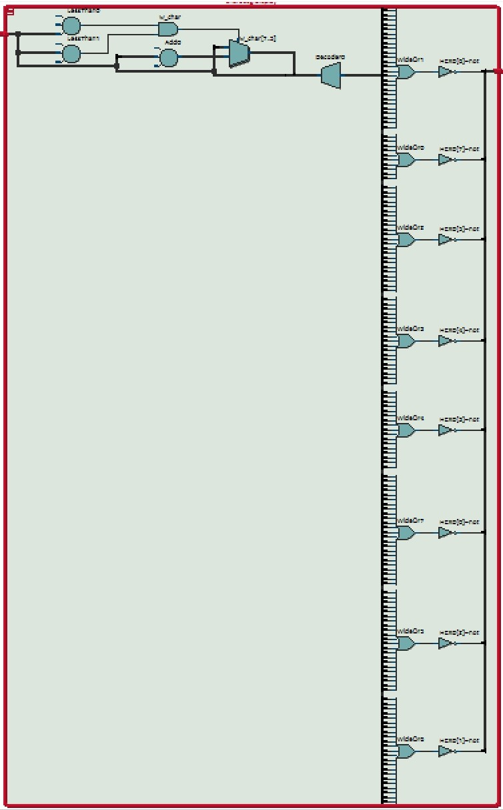 
  <em>Figure 16: 7-Segment Decoder RTL </em>

## Word Detector FSM
Implements a finite-state machine (FSM) to detect the sequence "HELLO" from serially received characters and blink the message on displays.
 
 

  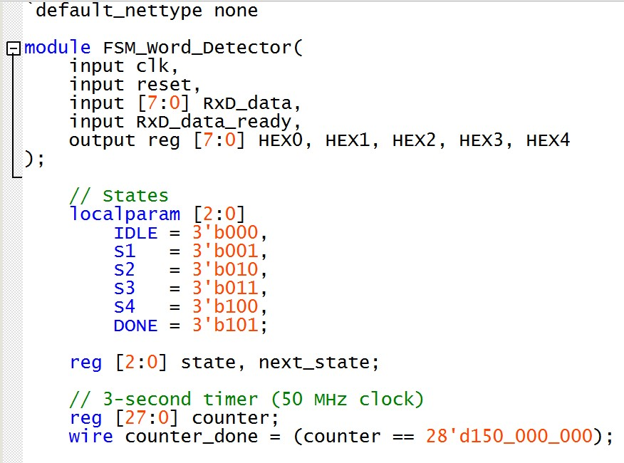 
  <em>Figure 17: Word Detector FSM </em>

  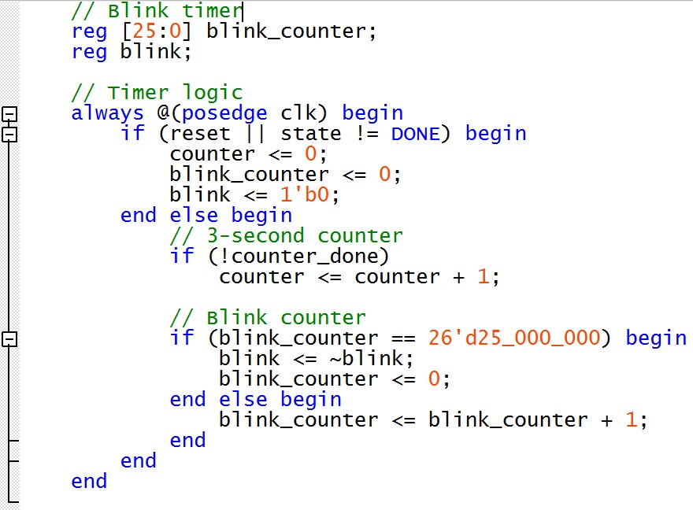 
  <em>Figure 18: Word Detector FSM </em>

  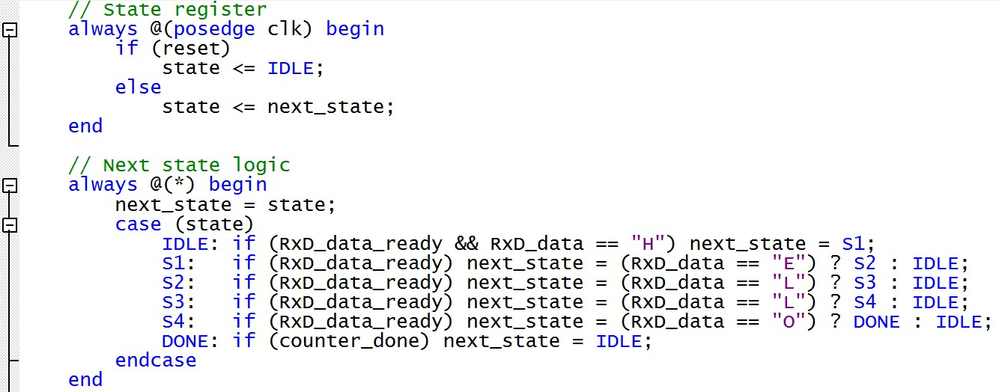 
  <em>Figure 19: Word Detector FSM </em>

  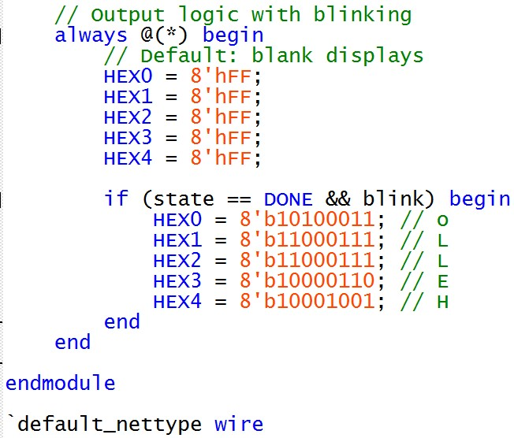 
  <em>Figure 20: Word Detector FSM </em>

 
 

Operations:
- States:
  - IDLE: Waits for the first character of the sequence "H" before proceeding.
  - S1: Verifies the second character "E".
  - S2: Verifies the third character "L".
  - S3: Verifies the fourth character, the second "L".
  - S4: Verifies the final character — "O".
  - DONE: Indicates that "HELLO" has been successfully detected.
  - Transitions through states upon receiving the letters "H", "E", "L", "L", "O".
- Timers:
  - 3-second timer for holding the message display.
  - Blink timer toggles display visibility at ~0.5 Hz.
- Output:
  - When in DONE and blink active, displays “HELLO” across HEX0–HEX4.
  - Returns to IDLE after timer expires or reset (SW[9]).
 
Each state is essentially waiting for a certain character to be entered before moving to the next, making it so that the "HELLO" display is not triggered until the sequence of characters is typed and lands on the DONE state.

 
 

  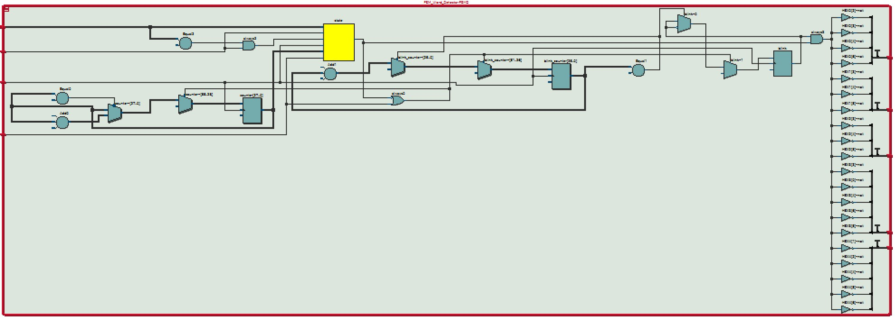 
  <em>Figure 21: Word Detector FSM RTL </em>

  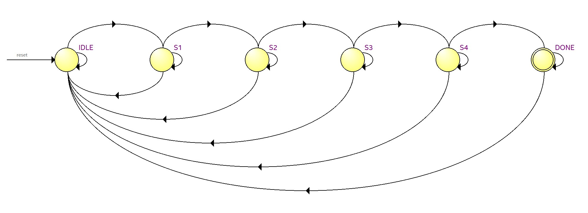 
  <em>Figure 22: Word Detector FSM </em>

## 3-Seconds Counter
A 3-second counter is created to keep the display (HELLO) blinking for 3-seconds after detection. Since the FPGA clock runs at 50 MHz, the design uses a counter-based timing system to measure that duration. This counter was implemented inside of the FSM rather than as an external module.
 
 

## Demonstration
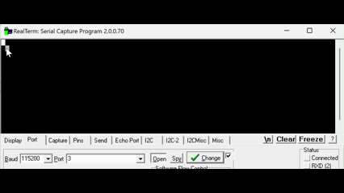
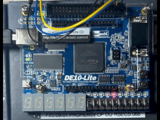
 
Videos are not in sync with each other

