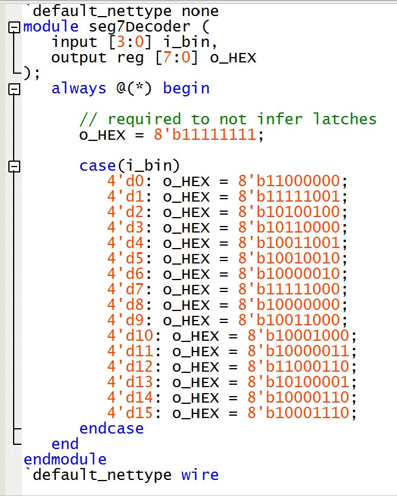
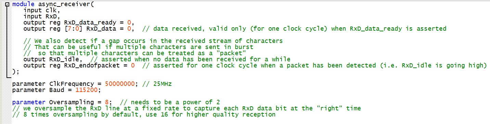
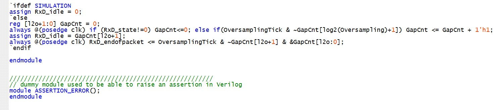
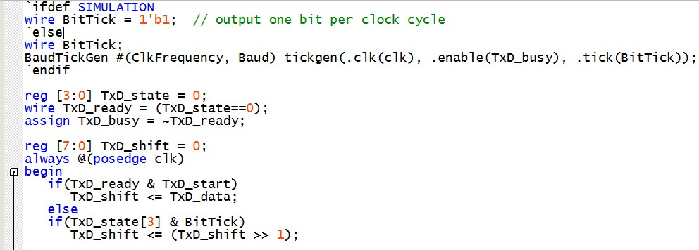
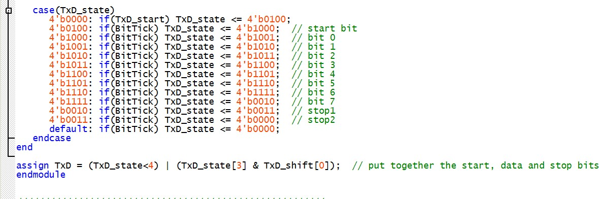
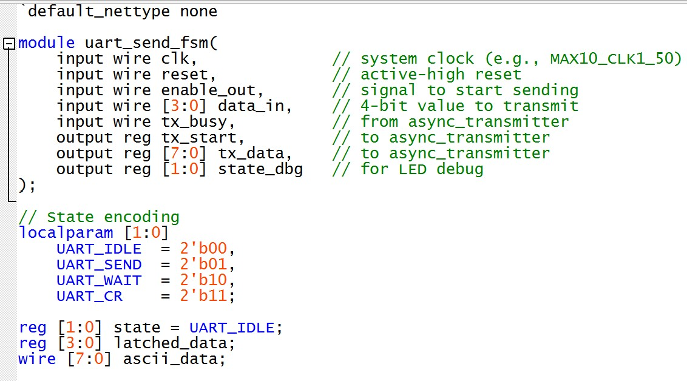
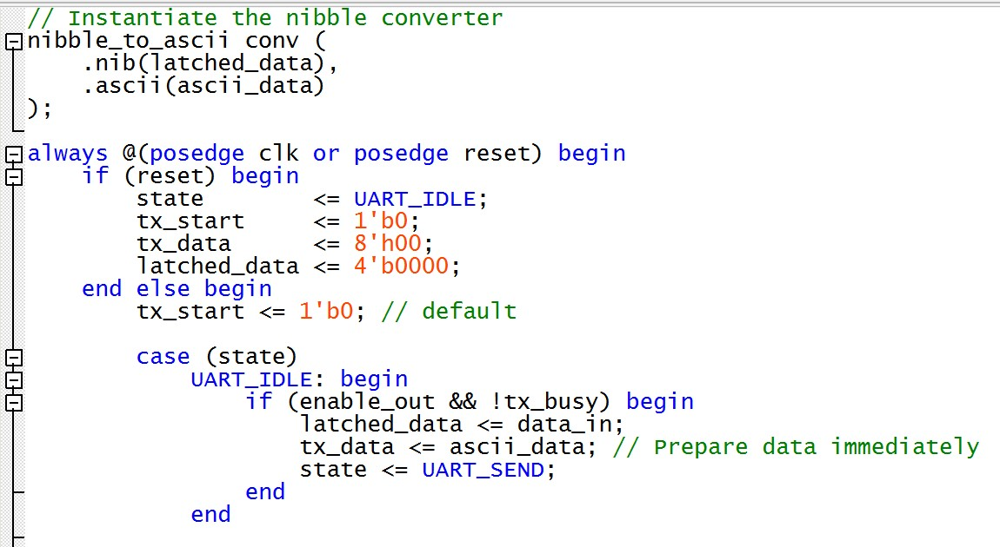

# Lab 8: Very Simple Mircroprocessor (VSM) with UART
*Duncan Wood*  
*10/27/2025*

## Simple Processor
The Very Simple Microprocessor (VSM) is a minimal CPU that operates by repeatedly fetching instructions from memory, decoding what operation to perform, and then executing that operation using registers, an arithmetic logic unit (ALU), and a shared internal data bus. The VSM can perform basic arithmetic (addition and subtraction), move data between registers, and handle simple input and output operations. Control of the system is managed by a finite state machine (FSM), which generates the timing and control signals that coordinate all components.
 
 

   
  <em>Figure 1: Very Simple Microprocessor </em>

 
 
The top-level code instansiates all of the componenets together, each of them communicating through a shared internal bus labeled "w_IB_BUS". The nine componenets included are:
 
 
- Accumulator A & B: Temporaray Data Registers
 
 
- Arithmetic Logic Unit (ALU): performs mathematical aritmic, in this case addition and subtraction.
 
 
- In and Out Registers: handle data moving in and out of switches and displays.
 
 
- Instruction Register:  Stores the current instruction and operand.
 
 
- Program Counter: tracks which instruction to fetch next.
 
 
- ROM Memory - stores the instruction sequence.
 
 
- FSM: the control unit generating timing and control signals.
 
 
7-segment displays are also set up to display the current 1-digit values of accummulators a and b, internal bus, user input, and final output (rOut).
 
 

   
  <em>Figure 2: VSM Top-Level Code </em>

   
  <em>Figure 3: VSM Top-Level Code </em>

   
  <em>Figure 4: VSM Top-Level Code </em>

   
  <em>Figure 5: VSM Top-Level Code </em>

   
  <em>Figure 6: VSM Top-Level Code </em>

   
  <em>Figure 7: VSM Top-Level Code </em>

   
  <em>Figure 8: VSM Top-Level Code </em>

### Instruction Control FSM
The Controll Unit aka Finite State Machine is essentially the brain of the CPU, coordinating all of the other modules.
 
 

   
  <em>Figure 9: VSM FSM Logisim </em>

 
 
The states of the FSM are:

- IDLE
- PHASE 1: Fetch
- Phase 2: Decode
- Phase 3: Execute A
- Phase 4: Execute B

The FSM progresses through the states sequentially: fetch the instruction, decode instruction, execute the instruction, fetch the next instruction. 
This follows the following for instruction decoding:

| Instruction Code (ToInstr) | Meaning | Operation |
|----------------------------|---------|-----------|
|0000                        |NOP      |do nothing |
|0001                        |ADD      |latch B, ALU add |
|0010                        |SUB      |latch B, ALU subtract |
|0011                        |OUT      |send to output |
|0100                        |IN       |read from input |
|0101                        |LDA      |load from memory |

The FSM follows the following sequence of operations.

- FETCH (Phase 1-2)
- 1. Program Counter outputs an address to ROM
- 2. ROM returns 8-bit instruction which is loaded into the Instriction Register.
- 3. FSM increments the program counter
- DECODE (Phase 2)
- 1. FSM reads the instruction code from the instruction register.
- EXECUTE (Phase 3-4)
- 1. Depending on the instruction code, FSM enables appropriate modules:
- 2. ALU for arithmetic
- 3. In/Out Registers for input/output data.
- 4. Accumulators for storage
- 5. Data moves through the shared bus controlled by the tri-state.
- NEXT INSTRUCTION
-  1. FSM cycles back to fetch the next ROM instruction.

   
  <em>Figure 10: VSM FSM Verilog Module </em>

   
  <em>Figure 11: VSM FSM Verilog Module </em>

   
  <em>Figure 12: VSM FSM Verilog Module </em>

   
  <em>Figure 13: VSM FSM Verilog Module </em>

   
  <em>Figure 14: VSM FSM Verilog Module </em>

   
  <em>Figure 15: VSM FSM Verilog Module </em>

   
  <em>Figure 16: VSM FSM Verilog Module </em>

   
  <em>Figure 17: VSM FSM Verilog Module </em>

 
 
The FSM makes the processor perform the following specific set of instruction code operations

| Address | Instruction (Hex) | Operation Code (bin) | Operand (bin) | Operation |
|---------|-------------------|----------------------|---------------|-----------|
| 0       | 55                | 0101                 | 0101          | LDA 5: Load A with 5 |
| 1       | 12                | 0001                 | 0010          | ADD 2: Add 2 to A    |
| 2       | 30                | 0011                 | 0000          | OUT 0: Output Result |
| 3       | 28                | 0010                 | 1000          | SUB 8: Subtract 8 from A|
| 4       | 30                | 0011                 | 0000          | OUT 0: Output result |
| 5       | 40                | 0100                 | 0000          | IN 0: Input from Switch|
| 6       | 13                | 0001                 | 0011          | ADD 3: Add 3 to A    |
| 7       | 30                | 0011                 | 0000          | OUT 0: Output Result | 

   
  <em>Figure 18: VSM FSM Quartus RTL </em>

   
  <em>Figure 19: VSM FSM Quartus State Machine View </em>

 
 
Overall, the FSM runs through the fetch,decode, execute cycle, operating all of the data movements across the bus and running the timers.

### Accumulator A
Stores one operand or result for the Arithmetic Logic Unit (ALU)

   
  <em>Figure 20: Accumulator A Logisim </em>

   
  <em>Figure 21: Accumulator A Verilog </em>

 
 
-  Sequential Logic: On each clock cycle, if LatchA is asserted, it loads a value from the internal bus (A input).
 
 
-  Combinational Logic: When EnableA is asserted, its current value drives the bus.
 
 
a tri-state bus is used (1'bz) to allow all of the component modules to share the one wire.
 
 

   
  <em>Figure 22: Accumulator A Quartus RTL </em>

### Accumulator B
Similarly to Accumulator A, Accumulator B store the second operand for the ALU.

   
  <em>Figure 23: Accumulator B Logisim </em>

 
 
- Simpler than A: no bus drive.
 
 
- On each clock, if LatchB is asserted, it captures B input.
 
 

   
  <em>Figure 24: Accumulator B Verilog </em>

   
  <em>Figure 25: Accumulator B Quartus RTL </em>

 
 
Accumulator B simply feeds operand B, the second operand, to the ALU.

### Arithmetic Unit
As its name suggests, the ALU  performs arithetic operations. For the purposes of this minimal CPU, only subtraction and addition can be done.
 
 

   
  <em>Figure 26: Arithmetic Unit Logisim </em>

   
  <em>Figure 27: Arithmetic Unit Verilog </em>

- Inputs A and B
- Control: EnableALU (activate), AddSub (0 = add, 1 = subtract)
- Outputs: Carry, IB_ALU
- Behavior:
- if disabled, outputs high impedance z.
- if enabled, performs either A+B or A-B with carry output.
 

   
  <em>Figure 28: Arithmetic Unit Quartus RTL </em>

 
 
The Arithmetic Logic Unit executes the addition and subtraction operations for each instruction.

### In Register
The In Register handles the inputs from the user switches.
 
 

   
  <em>Figure 29: In Register Logisim </em>

   
  <em>Figure 30: In Register Verilog </em>

- if EnableIn is high, drives the shared bus with DataIn
- Else, the register releases the bus (z).

   
  <em>Figure 31: In Register Quartus RTL </em>

 
 
Overall, the In register allows the VSM to read external inputs.

### Out Register
the Out Register handles the outputs, in this case the outputs for the 7-segment displays and LEDs.
 
 

   
  <em>Figure 32: Out Register Logisim </em>

   
  <em>Figure 33: Out Register Verilog </em>

- For each clock cycle, if EnableOut is on, the register captures data from the shared bus IB_BUS.
- Data output via rOut for LEDs and 7-segment displays

   
  <em>Figure 34: Out Register Quartus RTL </em>

 
 
The Out Register stores and sends the output data from the system.

### Instruction Register
The instruction register stores the current instruction data fetched from ROM.
 
 

   
  <em>Figure 35: Instruction Register Logisim </em>

   
  <em>Figure 36: Instruction Register Verilog </em>

- Inputs:
- Instr = instruction code
- Data = operand
- Control:
- LatchInstr loads Instr
- EnableInstr places Data on the shared Bus
- Output:
- ToInstr is the latched instruction for FSM decoding.
  

   
  <em>Figure 37: Instruction Register Quartus RTL </em>

 
 
The Instruction Register splits the instruction bytes and provides the control inputs to the FSM.

### Program Counter
The program counter sequenctially points to memory addresses.
 
 

   
  <em>Figure 38: Program Counter Logisim </em>

   
  <em>Figure 39: Program Counter Register Verilog </em>

- On Clock:
- If reset: clears to 0
- If enabled: increments by 1
- Output Counter feeds the ROM's address

   
  <em>Figure 40: Program Counter Quartus RTL </em>

The Program Counter controls the flow of the fetch sequence, operating as a clock that the FSM uses to iterate through the control sequence.

### ROM Memory
The ROM implements read only memory (ROM) for operation instructions, 8 locations with 8 bits each.
 
 

   
  <em>Figure 41: ROM Logisim </em>

   
  <em>Figure 42: ROM Register Verilog </em>

- High nibble = 4-bit instruction code
- Low nibble = 4-bit Data

   
  <em>Figure 43: ROM Quartus RTL </em>

 
 
Acts as memory for the instruction data, providing code for the VSM to execute.

### 7-Segment Decoder Module
The 7-Segment decoder is used to decode the 4-bit number character into the necessary 8-bit binary value needed for the hex displays.
 
 

   
  <em>Figure 44: 7-Segment Decoder Verilog Module </em>

- It converts a 4-bit number into the pattern needed for a 7-segment display.
- i_bin (4 bits): the binary number wanted to display.
- o_HEX (8-bit): controls which segments on the HEX display turn on or off.
- The always @(*) block means the output changes instantly when the input changes. It doesn't depend on positive vs. negative edge clock signal.
- The case statement checks the input value i_bin and assigns the correct segment pattern for digits 0-9 and letters A-F.
- Each bit in o_HEX corresponds to one segment of the display
- The bits are active low — a 0 turns a segment on, and a 1 turns it off.
- The line `default_nettype none ensures all signals are explicitly declared.
- Finally, `default_nettype wire resets that rule for other modules.

### Demo

## UART Integration

### UART Receiver

   
  <em>Figure 45: UART Receiver Verilog Module </em>

   
  <em>Figure 46: UART Receiver Verilog Module </em>

   
  <em>Figure 47: UART Receiver Verilog Module </em>

   
  <em>Figure 48: UART Receiver Verilog Module </em>

   
  <em>Figure 49: UART Receiver Verilog Module </em>

### UART Transmitter

   
  <em>Figure 50: UART Transmitter Verilog Module </em>

   
  <em>Figure 51: UART Transmitter Verilog Module </em>

   
  <em>Figure 52: UART Transmitter Verilog Module </em>

### Baud Rate Tick Generator

   
  <em>Figure 53: Baud Rate Tick Generator Verilog Module </em>

### UART Sender FSM

   
  <em>Figure 54: UART Sender FSM Verilog Module </em>

   
  <em>Figure 55: UART Sender FSM Verilog Module </em>

   
  <em>Figure 56: UART Sender FSM Verilog Module </em>

