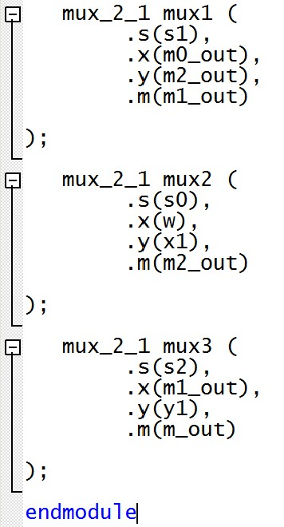
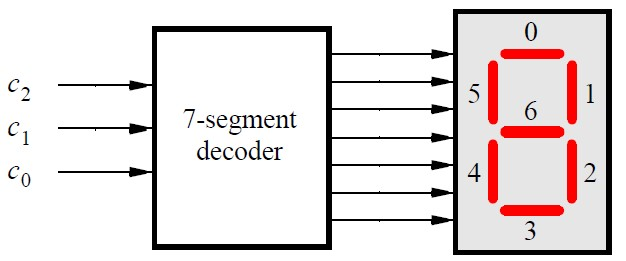
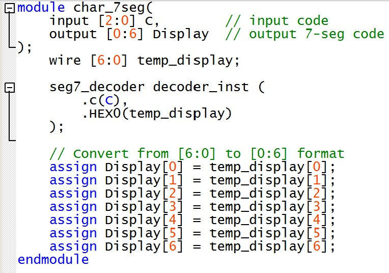

# Lab 1: Intro To Verilog
*Duncan Wood*  
*09/10/2025*

---

## Part I
First, a Verilog code was written to create a simple circuit inside the FPGA that directly connects the 10 toggle switches to their respective LEDs. When one switch is turned on, so does the red LED above it. 

   
  <em>Figure 1: Part I Code.</em>

---

## Part II

### 2-to-1 Multiplexer

   
  <em>Figure 2: 2-to-1 Multiplexer.</em>

 
The code below implements a simple 2-to-1 multiplexer based on the diagram and truth table in figure 2 above.
 

   
  <em>Figure 3: Part II Main Code.</em>

   
  <em>Figure 4: Part II 2-to-1 Multiplexer Code.</em>

### 8 Bit Wide 2-to-1 Multiplexer

   
  <em>Figure 5: 8 bit 2-to-1 Multiplexer </em>

 
To create an 8 bit mux, a series of the simple 2-to-1 muxes were connected together as shown in Figure 5 above. The Verilog code for this circuit is shown in figures 6 & 7 below.
 

   
  <em>Figure 6: Part II Main Code.</em>

 

   
  <em>Figure 7: Part II 8-bit Wide 2-to-1 Multiplexer Code.</em>

---

## Part III
The two figures below show the diagram and truth table for a 5-to-1 multiplexer

   
  <em>Figure 8: 5-to-1 Multiplexer Connection .</em>

   
  <em>Figure 9: 5-to-1 Multiplexer Table and Symbol.</em>

 

To create a 5-to-1 multiplexer, modules of the simple 2-to-1 multiplexers from Part II were connected as shown in Figure 8.

  
   
  <em>Figure 10: 3 Bit 5-to-1 Multiplexer Module.</em>

   
  <em>Figure 11: Main Code Setup.</em>

Figures 10 shows the 5-to-1 multiplexer module code, and Figure 11 shows the module instantiated onto the main code.

---

## Part IV

   
  <em>Figure 12: 7 Segment Display Decoder Diagram.</em>

   
  <em>Figure 13: 7 Segment Display Decoder Truth Table.</em>

 

Verilog code was written for a decoder that converts 3 bit binary codes into control signals for a 7-segment display as shown in figure 12. It can display H,E,L,O, and blank, with each segment controlled by Boolean expressions.
 
Figures 14 and 15 show the verilog code for the 7-segment display decoder.
 

   
  <em>Figure 14: 7-Segment Display Module.</em>

   
  <em>Figure 15: Main Code Setup.</em>

---

## Part V

   
  <em>Figure 16: 5-to-1 3-bit Input 7-Segment Decoder Diagram.</em>

   
  <em>Figure 17: 5-to-1 3-bit Input 7-Segment Decoder Truth Table.</em>

The 5-to-1 multiplexer from Part III and the 7-segment decoder from Part IV were combined to create a circuit that can select and display "HELLO" at various positions. Demonstrates how character patterns can be rotated across five 7-segment displays based on the select switches. The Verilog code can be found in Figures 18-22.

   
  <em>Figure 18: 5-to-1 3-bit Input Multiplexer.</em>

Figure 18 shows the Verilog code for the 5-to-1 Multiplexer Module used in the main code.

   
  <em>Figure 19: 3-bit Input 7-Segment Decoder.</em>

Figure 19 shows the Verilog code for the 7 segment display decoder module used in the main code.

   
  <em>Figure 20: Rotating HELLO Main Code A.</em>

   
  <em>Figure 21: Rotating HELLO Main Code B.</em>

   
  <em>Figure 22: Rotating HELLO Main Code C.</em>

---

### FPGA Output 
Figures 23-27 show all the display outputs from each of the 3 bit code combinations from the Verilog model of Part V.

   
  <em>Figure 23: FPGA Output 1.</em>

   
  <em>Figure 24: FPGA Output 2.</em>

   
  <em>Figure 25: FPGA Output 3.</em>

   
  <em>Figure 26: FPGA Output 4.</em>

   
  <em>Figure 27: FPGA Output 5.</em>

---

## Part VI
Part VI expands Part V to use all eight 7-segment displays on the FPGA board, creating s a system that can display 5-character words and rotate them across the displays, with blank characters filling unused positions. Shows advanced multiplexer interconnection patterns for creating scrolling text effects.
 

   
  <em>Figure 28: Updated 8-to-1 3-bit Input Multiplexer.</em>

 
The truth table in figure 28 above shows the Boolean logic for each display position.
 

   
  <em>Figure 29: Updated 8-to-1 3-bit Input Multiplexer.</em>

Using the 8-to-1 3 Bit Mux code from Part V was not fully successful.  
The first 3 input combinations worked, but the remaining only displayed "_HELLO" due to logic difficulties. Thus the 8-to-1 Multiplexer was written using a different method.
 
Figures 30-32 show the main Verilog code for Part VI
 

   
  <em>Figure 30: Part 6 Rotating HELLO Main Code A.</em>

   
  <em>Figure 31: Part 6 Rotating HELLO Main Code B.</em>

   
  <em>Figure 32: Part 6 Rotating HELLO Main Code C.</em>

---
### FPGA Output
Figures 33-40 show the FPGA output for each Boolean 3 bit code.

   
  <em>Figure 33: FPGA Output 1 Part VI.</em>

   
  <em>Figure 34: FPGA Output 2 Part VI.</em>

   
  <em>Figure 35: FPGA Output 3 Part VI.</em>

   
  <em>Figure 36: FPGA Output 4 Part VI.</em>

   
  <em>Figure 37: FPGA Output 5 Part VI.</em>

   
  <em>Figure 38: FPGA Output 6 Part VI.</em>

   
  <em>Figure 39: FPGA Output 7 Part VI.</em>

   
  <em>Figure 40: FPGA Output 8 Part VI.</em>

---
## Automatic 7-Segment Display Message

   
  <em>Figure 41:.</em>

A code was written to expand on Part VI by making the rotating display automatic without manually turning switches.

   
  <em>Figure 42: Clock Divider.</em>

Above is the Verilog module for the clock divider

   
  <em>Figure 43: Counter.</em>

Above is the Verilog module for the counter. 

   
  <em>Figure 44: Automatic Rotating Display A.</em>

   
  <em>Figure 45: Automatic Rotating Display B.</em>

Figures 44 and 45 above show the Verilog module for the automatic rotating 7-segment display

   
  <em>Figure 46: Automatic Rotating Display Main Code.</em>

### FPGA Output Demo

   
  <em>Figure 47: FPGA Demo.</em>

