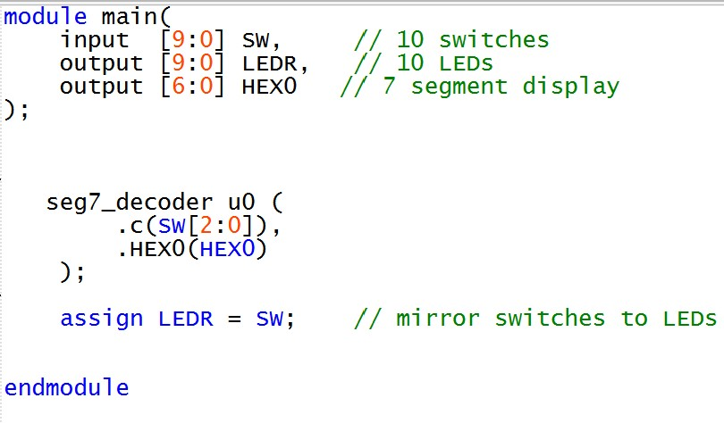

# Lab 1: Intro To Verilog
*Duncan Wood*  
*09/10/2025*

---

## Part I

   
  <em>Figure 1: Part I Code.</em>

---

## Part II

### 2-to-1 Multiplexer

   
  <em>Figure 2: Part II Main Code.</em>

   
  <em>Figure 3: Part II 2-to-1 Multiplexer Code.</em>

### 8 Bit Wide 2-to-1 Multiplexer

   
  <em>Figure 4: Part II Main Code.</em>

   
  <em>Figure 5: Part II 8-bit Wide 2-to-1 Multiplexer Code.</em>

---

## Part III

  
   
  <em>Figure 6: 3 Bit 5-to-1 Multiplexer Module.</em>

   
  <em>Figure 7: Main Code Setup.</em>

---

## Part IV

   
  <em>Figure 8: 7-Segment Display Module.</em>

   
  <em>Figure 9: Main Code Setup.</em>

---

## Part V

   
  <em>Figure 10: 5-to-1 3-bit Input Multiplexer.</em>

   
  <em>Figure 11: 3-bit Input 7-Segment Decoder.</em>

   
  <em>Figure 12: Rotating HELLO Main Code A.</em>

   
  <em>Figure 13: Rotating HELLO Main Code B.</em>

   
  <em>Figure 14: Rotating HELLO Main Code C.</em>

---

FPGA Output

   
  <em>Figure 15: FPGA Output 1.</em>

   
  <em>Figure 16: FPGA Output 2.</em>

   
  <em>Figure 17: FPGA Output 3.</em>

   
  <em>Figure 18: FPGA Output 4.</em>

   
  <em>Figure 19: FPGA Output 5.</em>

---

## Part VI

   
  <em>Figure 20: Updated 8-to-1 3-bit Input Multiplexer.</em>

Using the 8-to-1 3 Bit Mux code from Part V was not fully successful.  
The first 3 input combinations worked, but the remaining displayed "_HELLO" due to logic difficulties.

   
  <em>Figure 21: Part 6 Rotating HELLO Main Code A.</em>

   
  <em>Figure 22: Part 6 Rotating HELLO Main Code B.</em>

   
  <em>Figure 23: Part 6 Rotating HELLO Main Code C.</em>

---
FPGA Output

   
  <em>Figure 24: FPGA Output 1 Part VI.</em>

   
  <em>Figure 25: FPGA Output 2 Part VI.</em>

   
  <em>Figure 26: FPGA Output 3 Part VI.</em>

   
  <em>Figure 27: FPGA Output 4 Part VI.</em>

   
  <em>Figure 28: FPGA Output 5 Part VI.</em>

   
  <em>Figure 29: FPGA Output 6 Part VI.</em>

   
  <em>Figure 30: FPGA Output 7 Part VI.</em>

   
  <em>Figure 31: FPGA Output 8 Part VI.</em>

---
## Automatic 7-Segment Display Message

   
  <em>Figure 32: FPGA Demo.</em>

